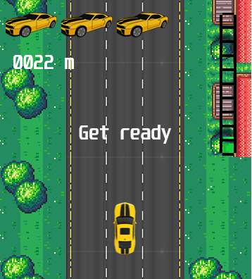
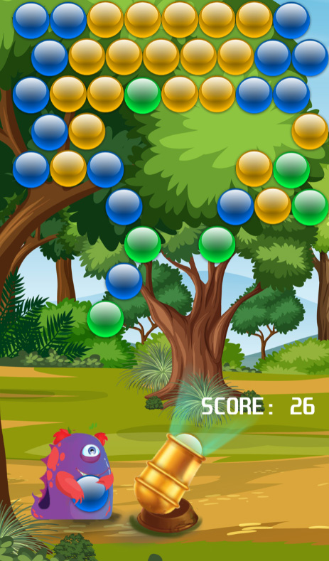
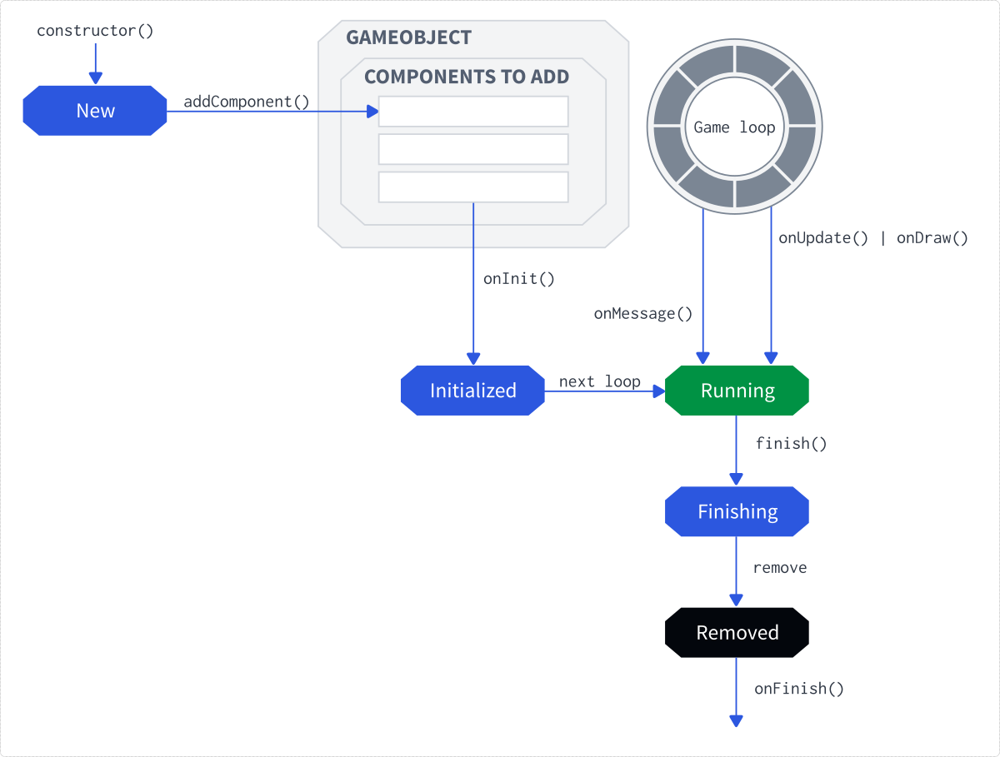
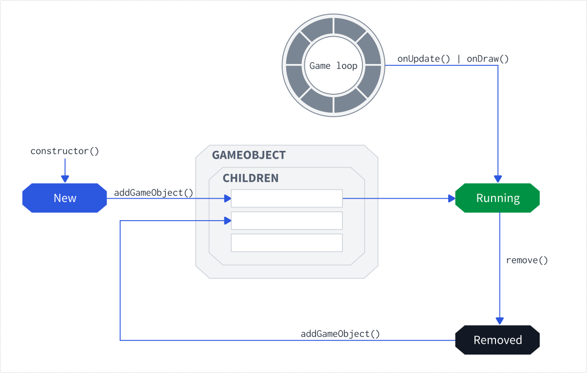

# COLF.IO

COLF.IO is an experimental Entity-Component-System library written in JavaScript with educational intentions to make it very easy to learn for anyone who would like to get to understand how interactive games can be programmed.

This library was built on the basis of my [C++ Game Engine](https://github.com/dodolab/CogEngine), having reused the major parts.

COLFIO = Component-Oriented Library For Interactive Objects

> :warning: **This version is no longer maintained. The project was rewritten into TypeScript on top of a [PixiJS](https://pixijs.com/) graphical library. You can still use it if you want to build vanilla-JS, no-bundle minigames. The current version can be found on [Github](https://github.com/colfio/colfio)**.

## Features
- Vanilla JavaScript
- Focused on providing a simple yet efficient API
- Simple Canvas API
- Scene Graph
- Game Loop
- Messaging system
- Asynchronous components

## Goals
The goal for COLF.IO is to be a lightweight and simple library that could be used for educational purposes. Therefore, it doesn't aim to provide complex features of HTML5 game engines. Instead, it should teach developers the basics of component-oriented programming

## Examples
- see the examples folder
- example1.html - renders an image
- example2.html - renders two squares and shows how DebugComponent works
- example3.html - shows how ChainComponent works
- example4.html - shows simple animations

### Speed Driver
- a simple game where you have three road lanes and you need to move you car between them not to collide with anything in the opposite direction



### Bubble Shooter
- a clone of the Bubble Shooter game
- the goal is to collect as many points as possible. To get the points, you need to destroy the colored bubbles. In order to burst those bubbles, you need to connect at least three bubbles of the same color.



# Usage

This library is written solely in JavaScript ES6 and doesn't require any bundling or transpiling libraries. You just include the following files in your HTML page along with the canvas element and you are good to go!

```html
<!DOCTYPE html>
<html lang="en">

<head>
  <meta content="text/html;charset=utf-8" http-equiv="Content-Type">
  <meta content="utf-8" http-equiv="encoding">
</head>

<body>
  <!-- Initialize the canvas, name it "gameCanvas"-->
  <canvas id="gameCanvas" width="600" height="400"></canvas>
  <!-- Create a script that will contain a function newGame to initialize the game-->
  <script type="text/javascript">		
    function newGame() {
      // ...
    }
  </script>
  <!-- Include all other scripts in the following order -->
  <script src="../src/sortedarray.js"></script>
  <script src="../src/imageloader.js"></script>
  <script src="../src/compengine.js"></script>
  <script src="../src/compenginecom.js"></script>
  <script src="../src/utils.js"></script>
  <script src="../src/main.js"></script>
</body>

</html>
```


## How does it work?
- the logic is implemented inside components - you declare a component, attach it to a game object, and via its `onUpdate` method, you can update the state

### Components
- each component has the following lifecycle functions:
  - `onInit` - initializes the component
  - `onMessage` - sends a message to all subscribed components
  - `onUpdate` - called during the game loop, updates the component state
  - `onDraw` - called during the game loop, can use CanvasAPI to render stuff
  - `onFinish` - called whenever this component has finished its execution
- if you want to add a new component to a game object, you have to call `addComponent` - it will add it to the queue of new components that will be added in the end of the loop
- any component can be terminated via `finish()` function



- **example**: creating a simple rectangle that will rotate

```javascript
let rect1 = new GameObject("rect1");
// 100x100 pixels
rect1.mesh = new RectMesh("rgb(255,0,0)", 100, 100);
rect1.trans.setPosition(20, 20);
// rendering component for all basic meshes
rect1.addComponent(new BasicRenderer());
rect1.addComponent(new RotationAnim());
scene.addGlobalGameObject(rect1);
```

### Game Objects
- game objects form a tree-like structure called a **Scene Graph**. Any transformation of an object applies to its children as well
- each object is added to the scene instantly
- every object has two main functions: `onUpdate()` and `onDraw()`, each of which calls all components attached to the object and calls respective functions upon them
- game objects that have an initialized `mesh` property, can be rendered via a `BasicRenderer`
- game objects have the following properties:
  - `tag` - a string that identifies the object
  - `trans` - transformation object
  - `attributes` - a list of attributes that can be accessed via string keys
  - `state` - a numeric state
  - `flags` - a bit array of flags

- **example**: how to use attributes and flags

```javascript
// creating a new object
let cannonBubble = new Builder("cannonBubble")
  .withAttribute('bubble', new Bubble(90, configMgr.bubbleSpeed, configMgr.getBubbleByIndex(0)))
  .withComponent(new BasicRenderer())
  .withComponent(new TileStaticAnimator())
  .withParent(cannon)
  .build(scene);

// we can now find the object by tag
cannonBubble = scene.findObjectByTag("cannonBubble");
cannonBubble.setFlag(12);
const hasFlag = cannonBubble.hasFlag(12); // true
// getting an attributef
const bubble = cannonBubble.getAttribute('bubble');

```



### Packages
- **Scene** - serves as a message bus and a scene manager, contains global components, game objects, and attributes
- **Component** - a basic unit of the ECS pattern. Components are attached to game objects, can subscribe to the messaging system via `subscribe()` and send messages to other components via `sendMessage`
- **GameObject** - game objects are mere containers for components and attributes


## API
- this is a documentation of the most important parts. Since the engine is very small, you can investigate all functions on your own by taking a look at the codebase. Each function and property has a JSDoc

### Unit Size
- unit size in px - all attributes are calculated against this size
- **example**:

```javascript
// each unit will have 100 pixels
UNIT_SIZE = 100;
let rect1 = new GameObject("rect1");
// now, the rectangle will have the size of 100x100 pixels
rect1.mesh = new RectMesh("rgb(255,0,0)", 1, 1);
```

### Scene
- `callWithDelay`
  - can call an action with a delay

```javascript
scene.callWithDelay(0.5, () => {
  playSound(ASSETS_SND_NEW_GAME);
});
```

- `submitChanges`
  - recursively recalculates absolute transformations of all game objects
- `addGlobalComponent`
  - attaches a component to the root object
- `findAllObjectsByTag`
  - finds all objects by their tags
- `clearScene`
  - removes all components and objects from the scene
- `sendMessage`
  - sends a message to all subscribed components
  - each component has its own `sendMessage` function which is more preferred, as the component attaches some metadata to it

### Flags
- `flags` is a bit array you can use to your own needs
- **example**:

```javascript
myObject.setFlag(12);
myObject.hasFlag(12); // true
myObject.resetFlag(12);
myObject.hasFlag(12); // false
```

### BBox
- each game object has a property `bbox` that represents a bounding box
- the bounding box gets recalculated at the end of each game object's update cycle
- you can use it to verify if two objects intersect by calling `intersects()`

### Mesh
- `Mesh` is a base class for all renderable structures
- if a game object contains a `BasicRenderer` component, the mesh will get rendered by using CanvasAPI
- the following mesh classes are implemented:
  - `RectMesh` - a simple rectangle
  - `TextMesh` - a text
  - `ImageMesh` - an image
  - `SpriteMesh` - a sprite whose texture is taken from a sprite atlas at given offset
  - `MultiSprite` - mesh that can render several sprites at once
  - `MultiSpriteCollection`- a collection of multi-sprites

```javascript
// will render a green rectangle
let rect2 = new GameObject("rect2");
rect2.mesh = new RectMesh("rgb(0,255,0)", 100, 100);
rect2.addComponent(new BasicRenderer());
```

### Trans
- `trans` is a property of each game object that represents transformation data, such as:
  - position, rotation, rotation offset, and absolute coordinates

```javascript
car.trans.posX = model.cameraPositionX;
car.trans.posY = model.cameraPositionY;
```

### GameObject
- **game objects are only shells for components and attributes**
- `state` is a numeric state you can use to implement a simple state machine
- `flags` is a bit array described above
- `submitChanges(recursively)` will recalculate transformations

### Msg
- messaging system uses a class `Msg` to store data
- `action` - action key (string), used by components to subscribe for a certain group of messages
  - special actions: 
    - `ALL` that is sent to **each** component
    - `OBJECT_ADDED` that is sent to inform subscribed components that a new game object has been added
    - `OBJECT_REMOVED` that is sent to inform subscribed components that an existing game object has been removed
- `component` - a component that sent the message
- `gameObject` - a game object to which the component that sent the message belongs
- `data` - any custom payload

### Component
#### Component API
- `onInit` - initializes the component
- `subscribe(action)` - subscribes for messages with a given action
- `unsubscribe(action)` - unsubscribes a message
- `sendMessage` - sends a message
- `onMessage` - called whenever the component receives a message
- `onUpdate` - game loop, called at 60FPS by default, used to update the component's state
- `onDraw` - dedicated for rendering purposes, called at 60FPS by default
- `onFinish` - called when the component is about to be finished and removed
- `finish` - will terminate the component and remove it from the game object

#### Component states
- each component can be in several of the following states (bit masks are used)
- `STATE_INACTIVE` - not active
- `STATE_UPDATABLE` -  `onUpdate` function can be invoked
- `STATE_DRAWABLE` - `onDraw` function can be invoked
- `STATE_LISTENING` - `onMessage` function can be invoked


### Built-in components
#### DebugComponent
- displays a debugging info - very handy!


#### BasicRenderer
- can be used for rendering of the `mesh` attribute

#### Animation
- TranslateAnimation - for translation

```javascript
let translateAnim = new TranslateAnimation(
    fromX, 
    fromY,
    toX,
    toY, duration);
```

- RotationAnimation - for rotation

```javascript
let rotateAnim = new RotationAnimation(
    from, 
    to,
    duration);
```

#### InputManager
- used for mouse/touch input
- first you need to specify what you want to capture
  - example: DOWN + MOVE: `new InputManager(INPUT_DOWN | INPUT_MOVE)`
- then you just use any component you like to subscribe to the following actions:
  - `MSG_TOUCH` - touch event
  - `MSG_DOWN` - pointer down event
  - `MSG_UP` - pointer up event
  - `MSG_MOVE` - pointer move event

#### ChainComponent
- this component is extremely powerful - you can use callbacks to implement a very complex behavior
- see `example3.html` for more information
- **example**: rotation every second

```javascript
myObj.addComponent(new ChainComponent()
  .beginInterval(1000)
    .execute((cmp) => cmp.owner.rotation += 0.1)
  .endInterval()
);
```

- functions:
  - `beginRepeat(times)` - `endRepeat` - will repeat the inner invocations
  - `execute` - will execute a function
  - `beginWhile(func)` - `endWhile()` - will repeat the inner invocations while the passed function returns true
  - `beginInterval(num)` - `endInterval()`- will repeat the inner invocations every num-seconds
  - `beginIf(func)` - `else` - `endIf()` - executes the inner invocation if the passed function returns true
  - `addComponentAndWait(component, gameObj)` - will add a component and wait until the component finishes
  - `waitTime(time)` - will wait the given number of seconds
  - `waitForFinish(component)` - will wait until the given component finishes
  - `waitUntil(func)` - will wait until the passed function returns true
  - `waitFrames(num)` - will wait the given number of frames
  - `waitForMessage(msg)` - will wait until the component receives a given message

### Utils
- `imageLoader` - loads images
- `sortedArray` - an extension for Array object for sorted arrays
- `Builder` - simplifies game object creation

```javascript
// using the builder
let obj = new Builder("rect1")
.withMesh(new RectMesh("rgb(255,0,0)", 1, 1))
.withPosition(2,2)
.withCenteredOrigin()
.withComponent(new BasicRenderer())
.asGlobal()
.build(scene);

// without the builder
let obj = new GameObject("rect1");
obj.mesh = new RectMesh("rgb(255,0,0)", 1, 1);
obj.trans.setPosition(2, 2);
obj.trans.rotationOffsetX = obj.mesh.width / 2;
obj.trans.rotationOffsetY = obj.mesh.height / 2;
obj.addComponent(new BasicRenderer());
scene.addGlobalGameObject(obj);
```

### Tests
- to make this repo as tiny as possible, there is no jest/mocha etc. The tests can be run by simply opening the `tests/run.html` file in your browser
- the output is displayed in the console log. If the tests pass, the screen will turn green. Otherwise it turns red.